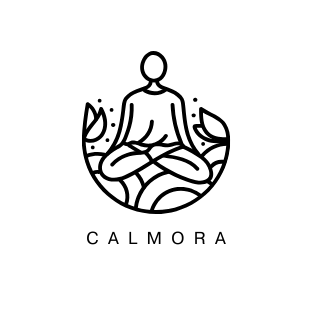

# Calmora – Where Mental Health Meets Trusted Care

---

## Overview

**Calmora** is a mental health application designed to support **Filipinos aged 16 and above** in understanding and managing their mental health concerns. Developed using **Flutter/Dart** for the mobile front-end, **Node.js** for the backend API, and **MongoDB** for data storage, Calmora combines technology and empathy to deliver secure, stigma-free mental health services.

One of its core features is an **AI-driven chatbot** named *Calmora* that offers ongoing emotional support, general guidance, and wellness tips – while respecting critical boundaries such as **not providing diagnoses or therapy**. Alongside this, educational content written by qualified mental health professionals further supports users in their journey.

> Through Calmora, the goal is to create a **safe, judgment-free space** where users are encouraged to express themselves without fear of stigma, while being guided toward better mental health.

---

## Key Features

### 🧠 **Specialist & Patient Accounts**
- Two separate user roles: **Specialists** and **Patients**.
- Role-specific features and access levels tailored to user needs.

---

### 📝 **Initial Survey**
- Appears **only once** at the start of the user’s journey.
- Helps the system tailor article recommendations based on user responses.
- **Survey results are hidden** from the user to maintain neutrality and avoid stress or bias.

---

### 📅 **Appointment Booking System**
- Patients can:
  - Browse specialists and choose a preferred one.
  - Book appointments based on available timeslots.
  - View appointment status in their dashboard.
  - Receive post-appointment feedback from specialists.

- Specialists can:
  - Accept or decline appointment requests.
  - Complete and provide feedback after sessions.
  - Optionally upload a photo (consultation doc or selfie) as session evidence.

---

### 🧑‍⚕ **Browse Specialists**
- Patients can:
  - Search by **name**, **specialization** (e.g., Psychologist, Psychiatrist, Counselor), or **gender**.
  - View specialist details including name, location, and expertise.
  - Convenient access to the **Book Appointment** button from the list or detail screen.

---

### 📚 **Browse Articles**
- Mental health articles written by verified professionals.
- Categories include:
  - Health
  - Social
  - Relationships
  - Personal Growth
  - Coping Strategies
  - Mental Wellness
  - Self-care

- Articles are recommended based on the user's initial survey.

---

### 💬 **Chat System & AI Chatbot (Calmora)**
- **One-on-One Chat**: Enables direct messaging between patients and specialists.
- **AI Chatbot (Calmora)**:
  - Provides general wellness tips and emotional support.
  - Supports **text and voice-based** conversation.
  - Trained to stay within mental health topics.

#### ❗ Important Notice:
> Calmora is **not** a licensed therapist and does **not** provide medical diagnoses or treatment advice. It is designed to simulate general emotional support and casual mental health conversations.  
> For serious concerns, users are **strongly encouraged** to book a session with a licensed specialist through the app.

---

## Technologies Used

- **Flutter & Dart** – Mobile front-end
- **Node.js** – API and backend logic
- **MongoDB** – Secure and scalable NoSQL database
- **Socket.IO** – Real-time chat and notification
- **AI/NLP Models** – For Calmora’s chatbot functionality

---
